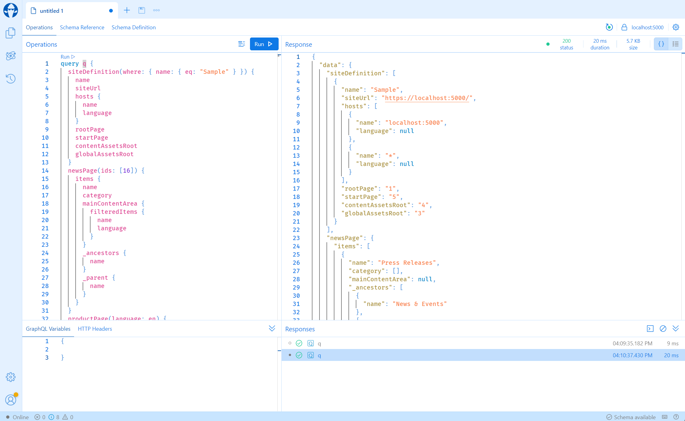

# Optimizely CMS GraphQL AddOn

This project is a powerful add-on for the Optimizely CMS that enables a GraphQL endpoint. It provides typed model access to all content models available in the system, allowing for efficient and flexible data fetching.

## Technologies

The project is built using:

- **C#** as the primary programming language.
- **Hot Chocolate**, a GraphQL server for .NET platforms.
- **Source Generation**, a feature of the C# compiler that enables compile-time metaprogramming.

## Features

- **Typed Model Access**: This add-on provides typed model access to all content models in the system.
- **GraphQL Endpoint**: It exposes a GraphQL endpoint, allowing clients to request exactly the data they need, reducing over-fetching and improving performance.
- **Integration with Optimizely CMS**: The add-on is designed to work seamlessly with Optimizely CMS, a popular content management system.

## How to Use

The addon is provided as a NuGet package. To get started, install the:  
[Vansterhant.Addon.Optimizely.GraphQL](https://www.nuget.org/packages/vansterhant.Addon.Optimizely.GraphQL/) package into your Optimizely CMS project.

Then add the following code to your `Startup.cs` file:

```csharp

public void ConfigureServices(IServiceCollection services)
{
    // ...
    services.AddOptimizelyGraphQL();
    // ...
    
    
    app.UseEndpoints(endpoints =>
    {
        // ...
        endpoints.MapGraphQL();
        // ...
    });
}
```
the GraphQL endpoint will now be available at `/graphql`. If one wishes to change the url, a string can be passed argument to the `MapGraphQL` method.

## Testing it out
The GraphQL endpoint is now available at `/graphql`. To test it out, navigate to the endpoint in your browser. You should see a GraphQL Playground, which allows you to explore the schema and test queries.  



## Contributing

Contributions are welcome! Please feel free to submit a pull request.

## License

This project is licensed under the MIT License. See the LICENSE file for more details.

## Contact

If you have any questions or feedback, please feel free to open an issue.

---

Please note that this is a brief overview of the project. For more detailed information, please dig into the source code. Happy coding! 🚀